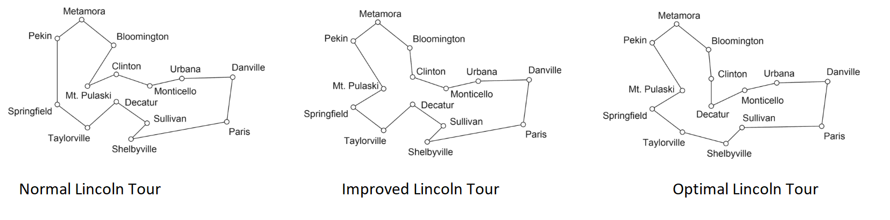

<link rel="stylesheet" type="text/css" href="http://cdn.datatables.net/1.10.5/css/jquery.dataTables.min.css">
<script src="http://code.jquery.com/jquery-2.1.2.min.js"></script>
<script src="http://cdn.datatables.net/1.10.5/js/jquery.dataTables.min.js"></script>

<script type="text/javascript">
         $(document).ready(function() {
             $("table").DataTable();
         } );
</script>

```{r GlobalOptions, echo=FALSE, message=FALSE}
options(knitr.duplicate.label = 'allow')
```

```{r setup, include=FALSE, message=FALSE}
knitr::opts_chunk$set(echo = TRUE)
```

```{r echo=FALSE, message=FALSE}
# This chunk automatically generates a file .R version of this script when running within knitr.
input  = knitr::current_input()  # filename of input document
output = paste(tools::file_path_sans_ext(input), 'R', sep = '.')
knitr::purl(input,output,documentation=1,quiet=T)
```

<p align="center">
  <a href="#introduction">Introduction</a> •
  <a href="#methods">Methods</a> •
  <a href="#results">Results</a> •
  <a href="#difficulties">Difficulties</a> •
  <a href="#literature">Literature</a>
</p>


# Introduction
For this assignment R is used as a vector GIS using different spatial concepts to come up with a reproducible approach in the end. After downloading a postal code Shapefile of Germany, a postal code is randomly selected and 0.5 degrees bounding box is stretched out around the postal code´s centroid. Afterwards the addresses for all DM drugstores lying within the bounding box are scraped and laid on top of a OSM street network for the chosen area. To solve the traveling salesman problem and find the shortest route between the drugstores, GRASS GIS is bound into R using rgrass7. The whole process is documented with Rmarkdown and the knit-r package. 
First, all needed packages for solving the tasks are imported (please notice section [Difficulties](#difficulties)) and all the mandatory path variables are previously defined. 
```{r import_em_all, echo=TRUE, warning=FALSE, message=FALSE, error=TRUE, results='hide'}
# -------------------------------------------------------------------------
# Environmental Settings
# -------------------------------------------------------------------------
library("knitr")
library("sf")
library("stringr")
library("rgeos")
library("rgdal")
library("leaflet")
library("tspmeta")
library("osrm")
library("cartography")
library("rgrass7")
library("osmdata")

# URI -------------------------------------------------------------
URI.plz = "https://www.suche-postleitzahl.org/download_files/public/plz-gebiete.shp.zip"
URI.grass = "C:/Program Files/GRASS GIS 7.8"
URI.icon = "./data/icon/dm_icon_20.png"

# Destination Paths -----------------------------------------------
dest.plz = tempfile("plz-gebiete", fileext = c(".zip"))  # Create a temporary file
dest.plz.shp = "./data/plz/plz-gebiete.shp"
dest.dm = "./data/dm/dm_loc_json.rds"
dest.route = "./data/grass_route.rds"
```

# Methods
In the following chapter all steps necessary to achieve the tasks are described.

## Data
The first step is to download all data needed.

### Postal Codes
The following code searches the path if the "./data/plz/plz-gebiete.shp"-file is already existing. If this is the case, no action is required. If it does not exist already, the script will search in `tempfile` if the file `plz-gebiete.zip` exists, otherwise it will be downloaded. The filder will be then unzipped to `"./data/plz/"`.

```{r import_plz, echo=TRUE, warning=FALSE}
# -------------------------------------------------------------------------
# Postal Codes
# -------------------------------------------------------------------------
# Download Postal Codes -------------------------------------------
if (!file.exists(dest.plz.shp)) {
  if (!file.exists(dest.plz)) {
    download.file(url = URI.plz, destfile = dest.plz)
  }
  unzip(dest.plz, exdir = 'data/plz')
}

```

The next script is reading the unzipped file at `"./data/plz/plz-gebiete.shp"` and selects the postal code range from `86150` to `89199` (Augsburg) afterwards. It then defines the core of the city, which is laying in the postal code `86150` and defines it as the center coordinates of the shape file.

```{r import_shape, echo=TRUE, warning=FALSE}
# Read PLZ Shape Files --------------------------------------------
plz.shp = read_sf(dest.plz.shp)
aug.shp = plz.shp[which((plz.shp$plz >= 86150 &
                           plz.shp$plz <= 86199)), ]

aug.center.shp = plz.shp[which((plz.shp$plz == 86150)), ]
aug.center.shp = as(aug.center.shp, "Spatial")
aug.center = gCentroid(aug.center.shp)  # Get center point
```

To define the *first*, *second* and the *third* order, the center coordinates for each polygon is defined. Then the distance between the centers to the and the core of the city is calculated. The distances are stored in a list. An attribute called `distance` is added to the shape file.

```{r import_shape2, echo=TRUE, warning=FALSE}
temp.dist = list()

for (i in 1:length(aug.shp$plz)) {
  plz = aug.shp$plz[i]
  center.x = gCentroid(as(plz.shp[which((plz.shp$plz == plz)), ], "Spatial"))
  
  p = st_sfc(st_point(c(aug.center$x, aug.center$y)),
             st_point(c(center.x$x, center.x$y)))
  dist = st_distance(p, p)[1, 2]
  temp.dist[[i]] = dist
}

temp.dist = unlist(temp.dist)
aug.shp$distance = temp.dist
aug.shp = as(aug.shp, "Spatial")

```

Then the function `qpal` is defined, which devides the distances in 4 areas. The postal code areas can now be plotted with leaflet.

```{r aug_map, echo=TRUE}
# Plot Postal Codes -----------------------------------------------
qpal = colorQuantile("Blues", aug.shp$distance, n = 4)


aug.map = leaflet() %>% setView(lng = aug.center$x,
                                lat = aug.center$y,
                                zoom = 11)

aug.map %>% addTiles() %>% addPolygons(
  data = aug.shp,
  weight = 1,
  color = ~ qpal(aug.shp$distance),
  smoothFactor = 0.5,
  opacity = 0.4,
  fillOpacity = 0.5,
  popup = paste0("<b>Postleitzahl: </b>" , "<br>",
                 aug.shp$plz),
  highlightOptions = highlightOptions(
    color = "white",
    weight = 2,
    bringToFront = TRUE
  )
)  %>% addPolygons(
  data = aug.center.shp,
  weight = 0.1,
  color = "red",
  smoothFactor = 0.5,
  opacity = 0.05,
  fillOpacity = 0.05,
  popup = paste0("<b>Postleitzahl: </b>" , "<br>",
                 aug.shp$plz),
  highlightOptions = highlightOptions(
    color = "white",
    weight = 2,
    bringToFront = TRUE
  )
)


```

```{r remove0, echo=FALSE}
rm(plz.shp)
rm(temp.dist)
rm(center.x)
rm(p)
rm(dist)
```

### DM Locations
*(please notice section [Difficulties](#difficulties))*

Next, the the location of the drugstores within a 0.05 bounding box are downloaded. Why there was a 0.05 instead of a 0.5 box was chosen is described in the chapter difficulties. The results are stored in `"./data/dm/dm_loc_json.rds"`

```{r dm_webscrap, echo=TRUE, warning=FALSE, message=FALSE}
# Scrab Locations
url = paste0(
  "https://www.dm.de/cms/restws/stores/find?requestingCountry=DE&", 
  "countryCodes=DE%2CAT%2CBA%2CBG%2CSK%2CRS%2CHR%2CCZ%2CRO%2CSI%", 
  "2CHU%2CMK&mandantId=100", 
  "&bounds=", aug.center$y - 0.05, 
  "%2C", aug.center$x - 0.05,
  "%7C", aug.center$y + 0.05,
  "%2C", aug.center$x + 0.05, 
  "&before=false&after=false&morningHour=9&eveningHour=18&_", 
  "=1479236790492")

dm.json = jsonlite::fromJSON(url)
saveRDS(dm.json, dest.dm)

dm.json = readRDS(dest.dm)
```

The addresses of the drugstores saved as `dm.json` variables look like this: `"Lechhauser Straße 13, bei Modepark Röther".` Because the second part, `bei Modepark Röther`, is not needed. To delete this part of the address the string after a `,` is seperated for each street name. Then the latitude and longitude information is extracted.

```{r dm_clean, echo=TRUE, warning=FALSE, message=FALSE}
# Cleaning Data
temp.address = list()
temp.x = list()
temp.y = list()

for (i in 1:length(dm.json$address$street)){
  temp.address[[i]] = matrix(unlist(strsplit(dm.json$address$street[i], ",")), 
                             ncol=2, byrow=TRUE)[1]
  temp.y[[i]] = dm.json$location[[i]][1]
  temp.x[[i]] = dm.json$location[[i]][2]
}

temp.address = unlist(temp.address)
temp.x = unlist(temp.x)
temp.y = unlist(temp.y)
```

In that manner, three temporary variables are generated: tep.address contains the street names, while temp.x and temp.y contain the x and y coodinates of the drugstores. These information are packed togerher into a data frame called `dm.data`. Ongoing, the data frame is converted into a spatial object using `st_as_sf`.

```{r dm_clean_data, echo=TRUE, warning=FALSE, message=FALSE}
# Generate DM Data -----------------------------------------------
dm.data = data.frame(
  city = dm.json$address$city,
  street = temp.address,
  plz = as.numeric(dm.json$address$plz),
  x = as.numeric(temp.x),
  y = as.numeric(temp.y),
  parking = dm.json$parkingTooltip
)

dm.sf = st_as_sf(x = dm.data,
                 coords = c("x", "y"),
                 crs = "+proj=longlat +datum=WGS84 +no_defs +ellps=WGS84 +towgs84=0,0,0")

dm.sf = as(dm.sf, "Spatial")
```

```{r remove1, echo=FALSE}
rm(i)
rm(temp.address)
rm(temp.x)
rm(temp.y)
rm(dm.json)
```

Here is the result of the previous steps.

```{r dm_map, echo=TRUE, error=TRUE}
# Plot DM Shops around Augsburg ----------------------------------
dm.icon = makeIcon(URI.icon,
                   iconWidth = 20,
                   iconHeight = 20)

dm.map  =  leaflet(dm.data) %>%
  addProviderTiles(providers$OpenStreetMap) %>%
  addMarkers(
    lng =  ~ x,
    lat =  ~ y,
    popup = paste0(
      "<b>Adresse: </b>" ,
      "<br>",
      dm.data$street,
      "<br>",
      dm.data$plz,
      " ",
      dm.data$city,
      "<br>",
      "<b>Parkplatzsituation: </b>",
      dm.data$parking
    ),
    icon = dm.icon[1]
  ) %>% addPolygons(
    data = aug.shp,
    weight = 1,
    color = ~ qpal(aug.shp$distance),
    smoothFactor = 0.5,
    opacity = 0.4,
    fillOpacity = 0.25,
    popup = paste0("<b>Postleitzahl: </b>" , "<br>",
                   aug.shp$plz),
    highlightOptions = highlightOptions(
      color = "white",
      weight = 2,
      bringToFront = TRUE
    )
  )
addLegend("bottomright",
          colors = dm.icon[1],
          labels = "DM'",
          title = "DM Shops um Augsburg")
dm.map
```

## Travelers Salesman Problem
Although the name traveling salesman has its origin somewhere in the 1970´s, the TSP is a very old theoretical, mathematical and later computational problem. Many attempts were made to solve this problem one way or another, but until today there isnt one perfect solution. The theoretical problem is about finding the best route between a finite number of places with known distances connecting them all. What was used to help workers and travelers in earlier times evolved to every day navigation and DNA computing. Figure 1 shows an easy example of such an traveling problem when President Lincoln wanted to travel the states. This solution optimized the route geometrically, not regarding infrastructure and topology. ([Applegate:2006](https://books.google.de/books?id=zfIm94nNqPoC&printsec=frontcover&dq=traveling+salesman+problem&hl=de&sa=X&ved=0ahUKEwie5LDTkO3mAhU0IMUKHTsVD8oQ6AEISTAE#v=onepage&q=traveling%20salesman%20problem&f=false))



# Results
First, the OSM street data is downloaded from open street maps within the bounding box.

```{r aoi_osm_download, echo=TRUE, warning=FALSE, message=FALSE}
# -------------------------------------------------------------------------
# TSP with "GRASS"
# -------------------------------------------------------------------------
b_box = st_bbox(dm.sf)
aoi.streets = opq(b_box) %>%
  add_osm_feature(key = "highway") %>%
  osmdata_sf() %>%
  `[[`("osm_lines")

aoi.streets = dplyr::select(aoi.streets, osm_id)
```

In the next step, GRASS GIS is initialized in order to be used in R. The in GRASS generated data is stored in a database located at `"./data/grass/augsburg"`.

```{r init_grass, echo=TRUE, warning=FALSE, error=TRUE, message=FALSE}
initGRASS(
  gisBase = URI.grass,
  home = "./data/grass",
  gisDbase = "./data/grass",
  location = "augsburg",
  mapset = "PERMANENT",
  override = TRUE
)

```

Now, the projection, the extent and the resolution is defined.

```{r init_db, echo=TRUE, warning=FALSE, error=TRUE, message=FALSE}
execGRASS(
  "g.proj",
  flags = c("c", "quiet"),
  proj4 = st_crs(aoi.streets)$proj4string
)

b_box = st_bbox(aoi.streets)
execGRASS(
  "g.region",
  flags = c("quiet"),
  n = as.character(b_box["ymax"]),
  s = as.character(b_box["ymin"]),
  e = as.character(b_box["xmax"]),
  w = as.character(b_box["xmin"]),
  res = "1"
)
```

Before GRASS geoalgorithms can be used, data has to be added to GRASS´spatial database using the function `writeVECT()`. Street names and data regarding the drugstores are added and named `aoi_streets` and `dm`.

```{r write, echo=TRUE, warning=FALSE, error=TRUE, message=FALSE}
writeVECT(SDF = as(aoi.streets, "Spatial"), vname = "aoi_streets")
writeVECT(SDF = dm.sf, vname = "dm")
```

For a mathematical correct analysis it is necessary to remove duplicates, small angles and dangles from the street network. The GRASS function `v.clean` can break lines at each intersection, so that the driver can turn left and right. This output is saved `as aoi_streets_clean`. To ensure that every drugstore is able to be reaches by the driver, they are connected to the street segment closest to them with `v.net`. This output is saved as `aoi_points_connected`. ([GRASS through rgrass7](https://www.bookstack.cn/read/Robinlovelace-geocompr/spilt.5.11.md))

```{r connect_points, echo=TRUE, warning=FALSE, error=TRUE, message=FALSE}
# clean street network
execGRASS(
  cmd = "v.clean",
  input = "aoi_streets",
  output = "aoi_streets_clean",
  tool = "break",
  flags = "overwrite"
)

# connect points with street network
execGRASS(
  cmd = "v.net",
  input = "aoi_streets_clean",
  output = "aoi_points_connected",
  points = "dm",
  operation = "connect",
  threshold = 0.001,
  flags = c("overwrite", "c")
)
```

In the next step the cleaned data is used as input for the `v.net.salesman` function. Finally the shortest route can be calculated.
([GRASS through rgrass7](https://www.bookstack.cn/read/Robinlovelace-geocompr/spilt.5.11.md)) 

```{r tsp_alg, echo=TRUE, warning=FALSE, error=TRUE, message=FALSE}
execGRASS(
  cmd = "v.net.salesman",
  input = "aoi_points_connected",
  output = "tsp_result",
  center_cats = paste0("1-", nrow(dm.sf)),
  flags = c("overwrite")
)

grass.route = readVECT("tsp_result") %>%
  st_as_sf() %>%
  st_geometry()
```
The final result is visualized in the following map.
```{r result_map_tsp, echo=TRUE, warning=FALSE, error=TRUE, message=FALSE}


grass.route.map  =  leaflet(dm.data) %>%
  addProviderTiles(providers$OpenStreetMap) %>%
  addMarkers(
    lng =  ~ x,
    lat =  ~ y,
    popup = paste0(
      "<b>Adresse: </b>" ,
      "<br>",
      dm.data$street,
      "<br>",
      dm.data$plz,
      " ",
      dm.data$city,
      "<br>",
      "<b>Parkplatzsituation: </b>",
      dm.data$parking
    ),
    icon = dm.icon[1]
  ) %>% addPolygons(
    data = aug.shp,
    weight = 1,
    color = ~ qpal(aug.shp$distance),
    smoothFactor = 0.5,
    opacity = 0.4,
    fillOpacity = 0.25,
    popup = paste0("<b>Postleitzahl: </b>" , "<br>",
                   aug.shp$plz),
    highlightOptions = highlightOptions(
      color = "white",
      weight = 2,
      bringToFront = TRUE
    )
  ) %>%
  addPolylines(
    data = grass.route,
    color = "#ff2500",
    weight = 3,
    opacity = 3
  ) %>%
  
  addLegend("bottomright",
            colors = dm.icon[1],
            labels = "DM'",
            title = "DM Shops um Augsburg")
grass.route.map

```

# Difficulties

1. The settings of this assignment gains for a 0.5 degree bounding box. But with this size of a bounding box using the function
```
b_box = st_bbox(dm.sf)
aoi.streets = opq(b_box) %>%
  add_osm_feature(key = "highway") %>%
  osmdata_sf() %>%
  `[[`("osm_lines")
```
the downloaded street network can not be used because this error occurs:
```
Fehler: kann Vektor der Größe 4.6 GB nicht allozieren
```

2. With some distances, especially a larger sector for the drugstores, the algorithm was not able to calculate any solution.
```
> execGRASS(
+   cmd = "v.net.salesman",
+   input = "aoi_points_connected",
+   output = "tsp_result",
+   center_cats = paste0("1-", nrow(dm.sf)),
+   flags = c("overwrite")
+ )
Number of cities: 14
Erzeuge Graphen...
Registriere arcs...
 100%
Mache den Graph flach...
Graph wurde erstellt.
Creating cost cache...
FEHLER: Destination node [cat 1] is unreachable from node [cat 14]
```
After a little testing the best results were made with a bounding box at 0.05 degree.

3. Because osm data is using its own modified sf version, plotting the street network via leaflet was not possible. [see here](https://github.com/ropensci/osmdata/issues/100)

# Literature

Applegate, D.L., Bixby, R.E., Chvatal, V., Cook, W.J. 2006: The Traveling Salesman Problem: A Computational Study. Princetown University Press, Princetown New Jersey. 
 
GRASS through rgrass 7: https://www.bookstack.cn/read/Robinlovelace-geocompr/spilt.5.11.md, last visit 05.01.2020.
